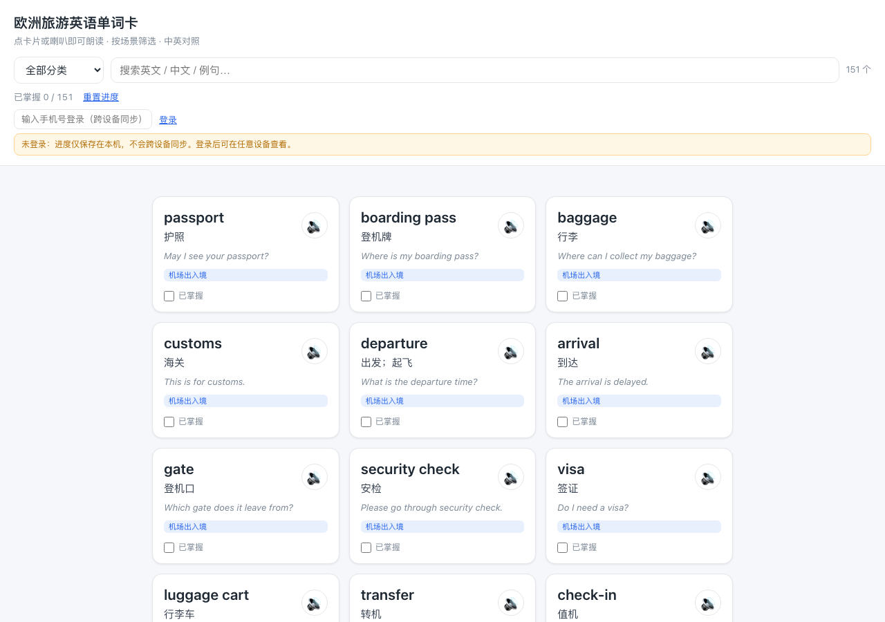

# gin-words

欧洲旅游英语单词卡 —— 给自己用的纯前端单词速查网站，配套 CloudBase 云函数做云端进度持久化。

本仓库是一个工作仓库，目录结构如下：

| 路径 | 说明 |
| --- | --- |
| `2026-08-11-09-37-38/` | 项目主体：单文件前端 `index.html`、词库校验 `test/validate.mjs`、CloudBase 配置 `cloudbaserc.json`、构建产物 `dist/` |
| `2026-08-11-09-37-38/README.md` | 项目详细文档（功能、用法、词库、校验、部署） |
| `cloudfunctions/wordProgress/` | 云端进度读写云函数（CloudBase Web 函数，Node.js） |
| `2026-08-11.md` | 开发工作记录 |

## 快速了解

- **前端**：双击 `2026-08-11-09-37-38/index.html` 即可打开，零依赖、无需联网（朗读功能需浏览器 Web Speech API）。
- **校验**：`node 2026-08-11-09-37-38/test/validate.mjs` 校验词库（词数 ≥120、分类 ≥8、en 不重复、字段完整）。
- **后端**：`cloudfunctions/wordProgress/index.js` 为 CloudBase 云函数，使用 `@cloudbase/node-sdk` 读写进度数据。

## 预览

### 网页端（桌面）

### App 端（移动）

## 仓库发布文件

本仓库已按 GitHub 发布标准补齐以下文件：

- `LICENSE` — MIT
- `SECURITY.md` — 安全与私有报告指引
- `CONTRIBUTING.md` — 贡献规范
- `CODE_OF_CONDUCT.md` — 行为准则
- `PRE_UPLOAD_CHECKLIST.md` / `PRIVACY_SECURITY_CHECKLIST.md` / `GITHUB_SETTINGS_CHECKLIST.md` — 发布前检查清单
- `.github/` — PR 模板、Issue 模板、Dependabot 配置

详细项目说明请参阅 [`2026-08-11-09-37-38/README.md`](2026-08-11-09-37-38/README.md)。
